# Royal Chess


## Table Of Contents:

* [Overview](#overview)
* [Features](#features)
* [Screenshots](#screenshots)
* [Compatibility](#compatibility)
* [Build Instructions](#build-instructions)
* [Test Cases](#test-cases)
* [Data Structures](#data-structures)
* [Pseudocode Of Important Functions](#pseudocode-of-important-functions)
* [Visual Pseudocode (aka. Flowchart)](#visual-pseudocode-aka-flowchart)
* [Credits](#credits)
* [License](#license)

## Overview

*Royal Chess* is an open source 2D chess game made with *Simple DirectMedia Layer* 2. Its source code is completely written using the most recent standard for C programming language *(C17)*.

## Features

* A fully functional chess game made with *SDL2*.
* Supported by well-selected sound effects.
* Customized cursor matching the royal design of the game.
* Customized loading screen to promote yourself.
* Game can be run in either Fullscreen mode or Windowed mode.
* Supports any resolution that is a multiplier of (640*480).
* All images and textures are included as SVG files.
* All assets are bundled with the actual game in one executable file.
* Showing the algebraic notations of every played move during the game.
* Supports undoing game till the first move or redoing it till the last move.
* Game can be saved locally to be continued later.
* Saved game includes its movements history.
* Showing all possible moves that can be moved by the selected piece.
* Chess board is rotated when the second player should play.
* Possibility of starting a new game without toothing the existing saved game.
* Supports *En Passant* and *Castling* moves.
* Supports pawn promotion.
* Detection of dead position in case one of the following conditions is met:
  * king versus king.
  * king and bishop versus king.
  * king and knight versus king.
  * king and bishop versus king and bishop with the bishops on the same color.
* Game can be ended by one of the following means:
  * Checkmate
  * Stalemate
  * Dead Position
  * Draw Offer
  * Resign
* Once a game is ended, a PGN file for this game is saved automatically.

## Screenshots

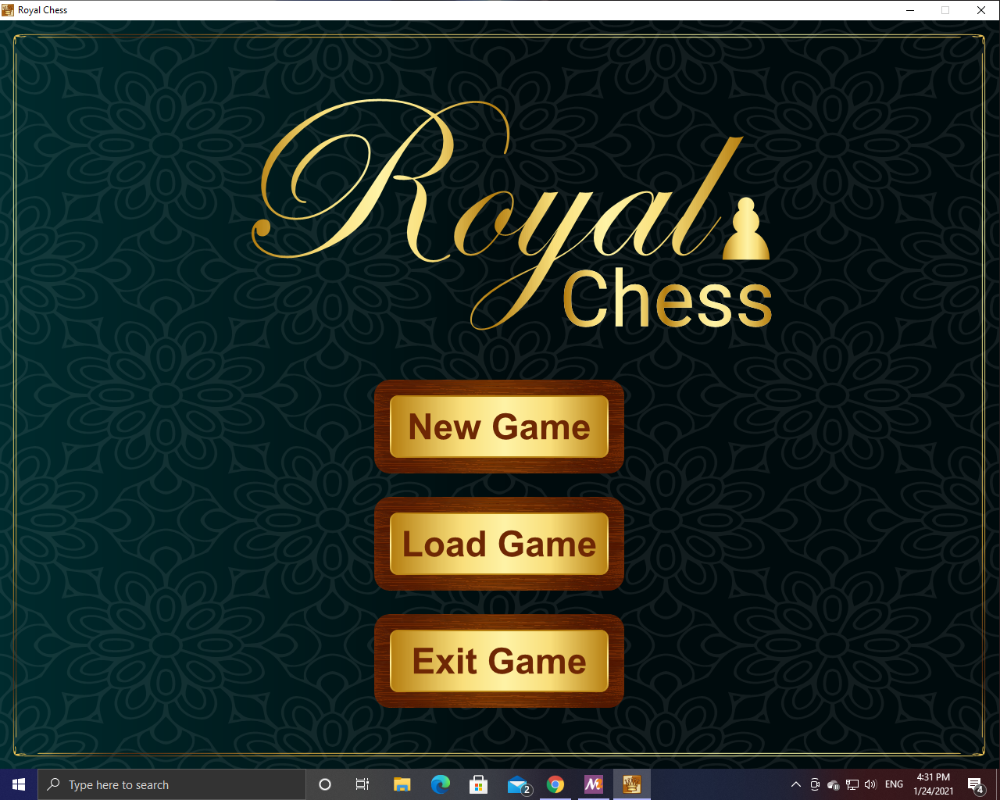

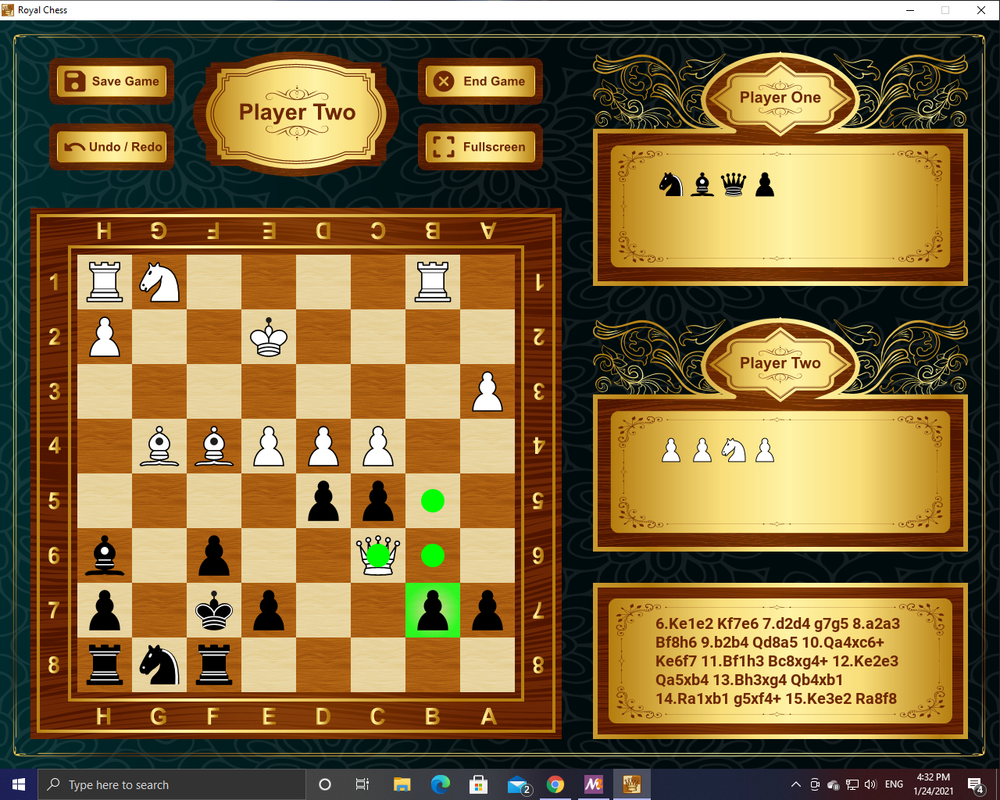


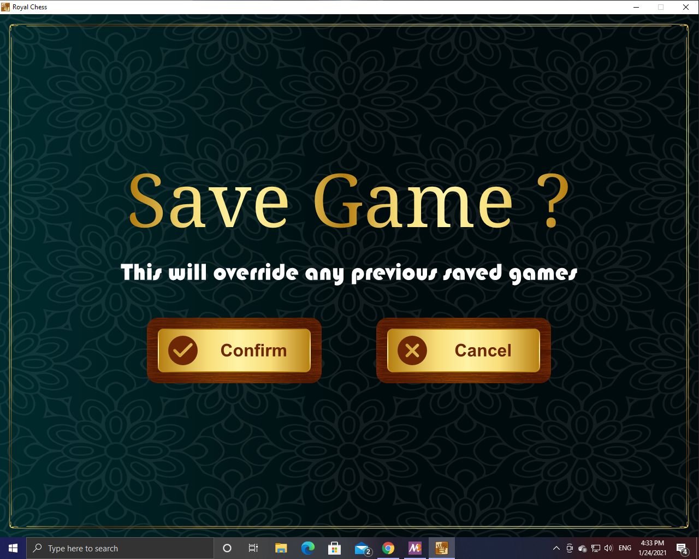

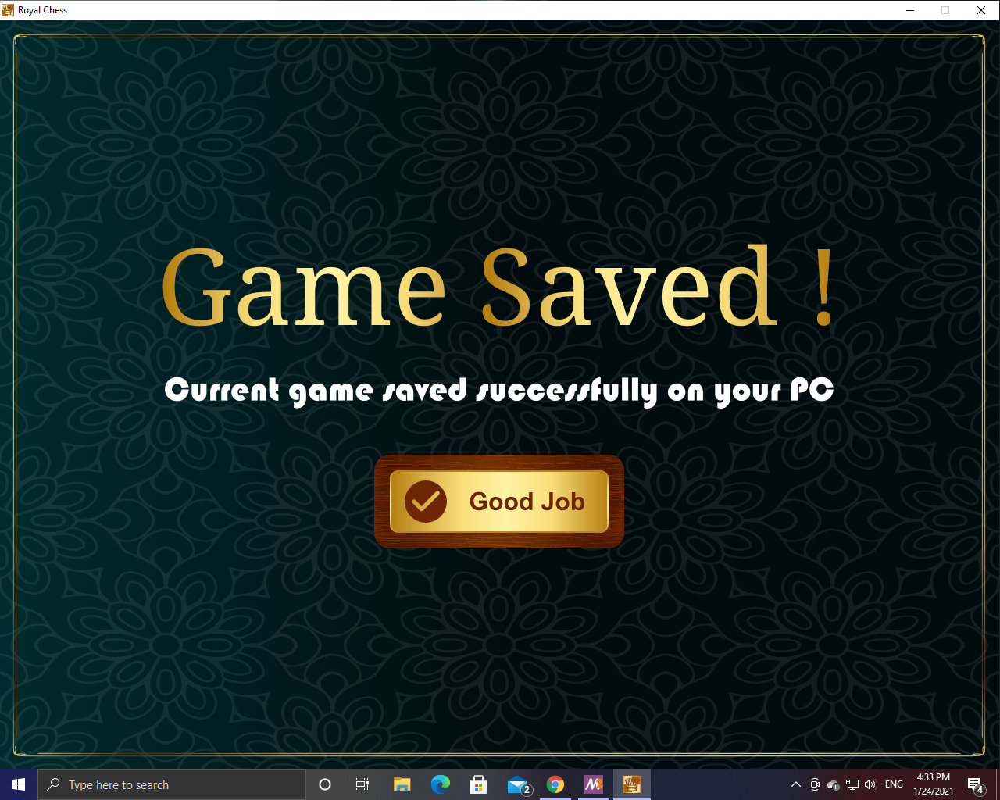

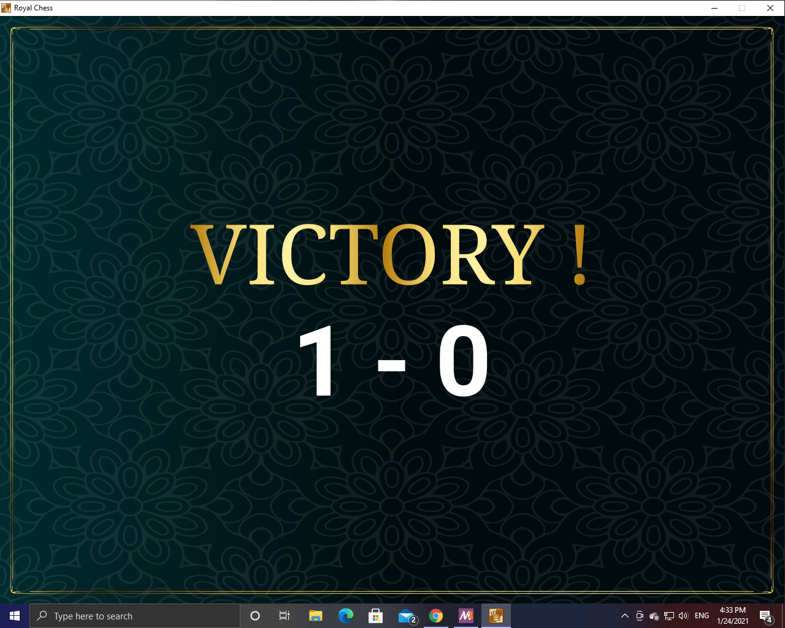

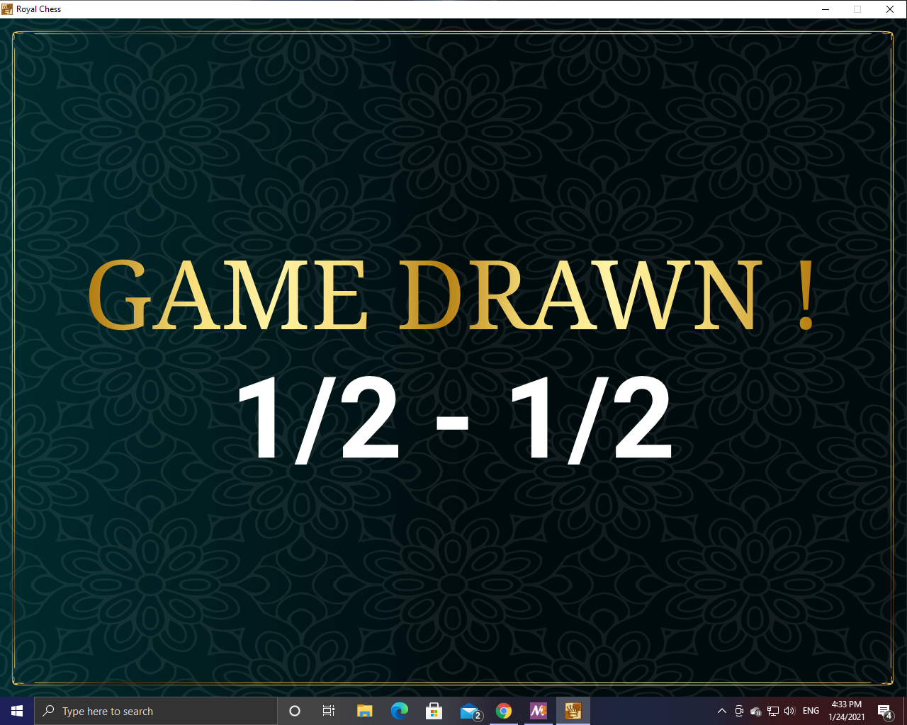

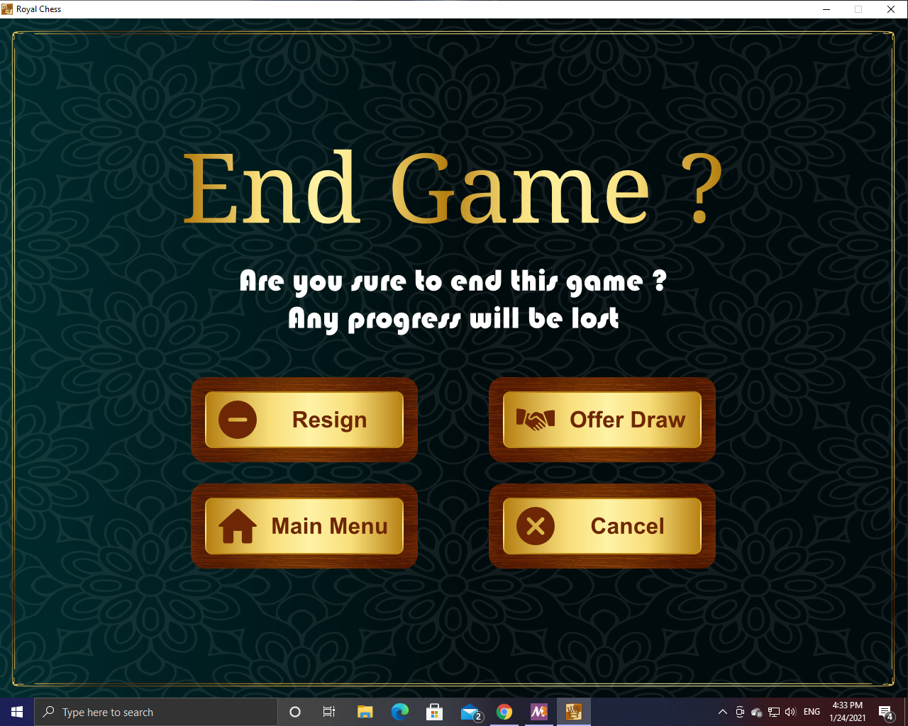

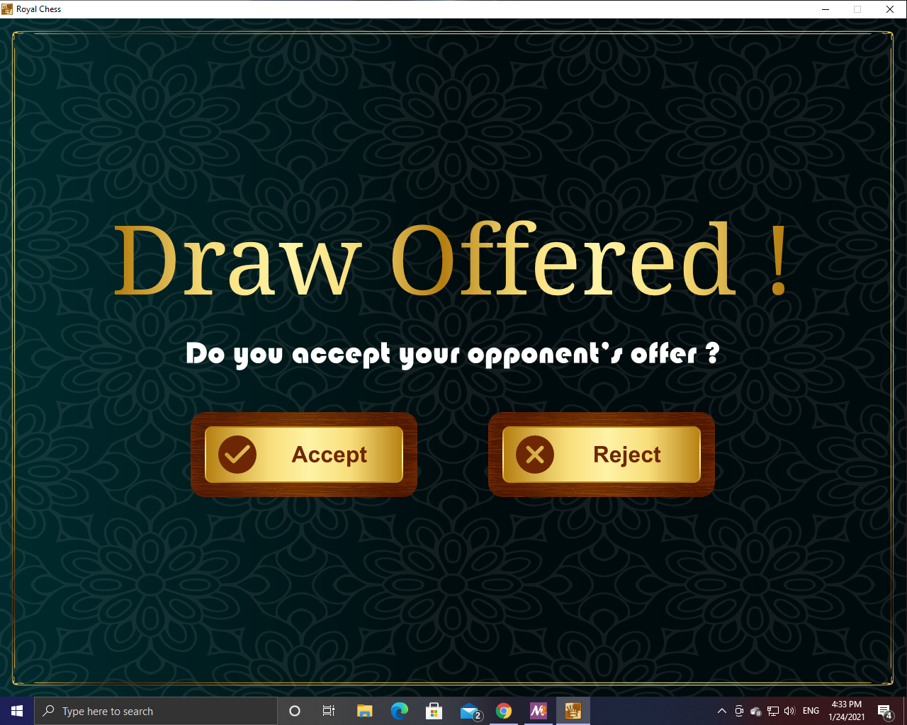

## Compatibility

*Royal Chess* is supposed to work on all platforms supported by [SDL2](https://wiki.libsdl.org/Installation). However, It was tested only on the following operating systems:

* Microsoft Windows 2000 Service Pack 4 ***(SDL2 have to be recompiled with SDL_Log removed)***
* Microsoft Windows XP Service Pack 3
* Microsoft Windows 7 Service Pack 1
* Microsoft Windows 10 Insider Preview Build 21292

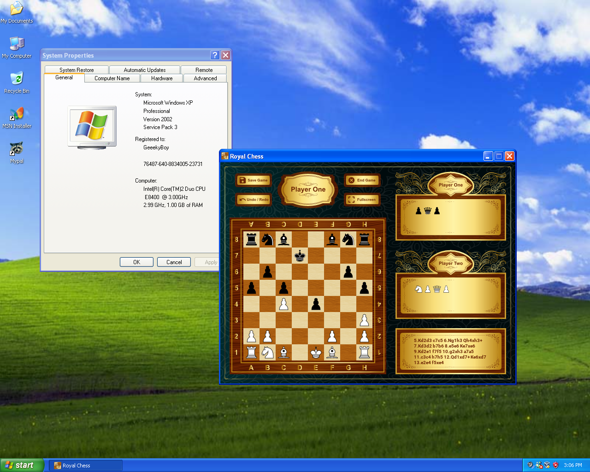

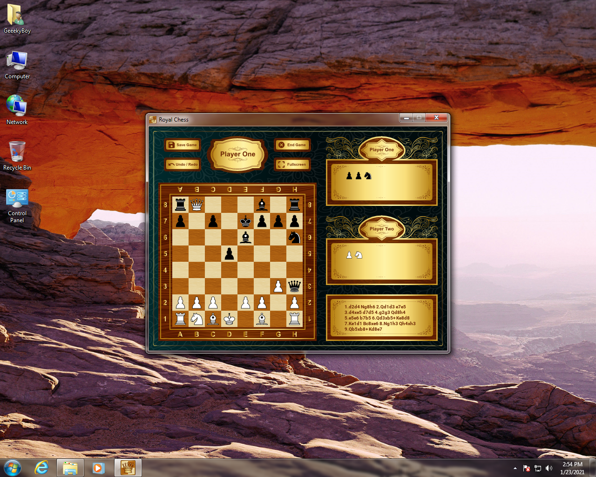

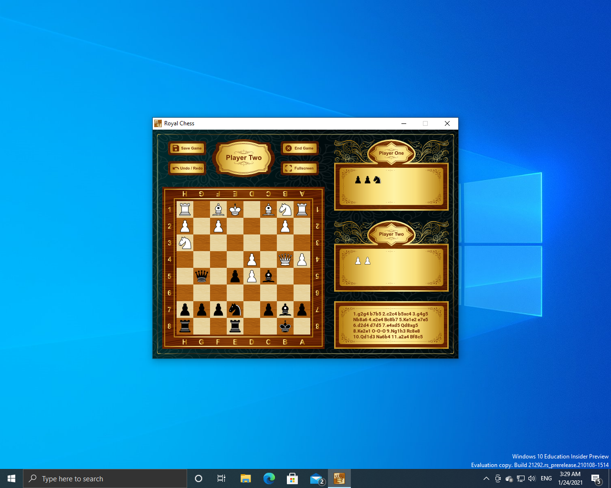

## Build Instructions

### Windows

In order to build *Royal Chess* for 32bit and 64bit versions of *Windows*, you have to follow the following procedure. ***You may skip some steps if you have done them already !***

1. Install *MSYS2* from https://www.msys2.org/

2. Run *MSYS2*.

3. Execute commands below in order to get *GCC* and SDL2 installed.

```bash
   pacman -S --needed base-devel mingw-w64-x86_64-toolchain
   pacman -S --needed base-devel mingw-w64-i686-toolchain
   pacman -S mingw-w64-x86_64-SDL2
   pacman -S mingw-w64-i686-SDL2
   pacman -S mingw-w64-x86_64-SDL2_mixer
   pacman -S mingw-w64-i686-SDL2_mixer
   pacman -S mingw-w64-x86_64-SDL2_ttf
   pacman -S mingw-w64-i686-SDL2_ttf
```

4. Within *MSYS2* terminal, go to the root of *Royal Chess* source code where *Makefile* exists.

5. Execute the command below.

```bash
   make
```

## Test Cases

### Jonathan F Parker vs Nicholas Pert (1999)

**This game was ended by a resign.**

```
[Event "Royal Chess"]
[Site "Personal Computer"]
[Date "2021.01.22"]
[Round "1"]
[White "Player 1"]
[Black "Player 2"]
[PlyCount "64"]
[Result "0-1"]

1.d2d4 e7e6 2.c2c4 f7f5 3.g2g3 Ng8f6 4.Bf1g2 Bf8e7 5.Ng1f3 O-O 6.O-O Nf6e4 7.d4d5 Be7f6 8.Nf3d2 Ne4xd2 9.Qd1xd2 Qd8e7 10.Nb1c3 Bf6xc3 11.Qd2xc3 e6e5 12.b2b3 d7d6 13.c4c5 b7b6 14.c5c6 a7a5 15.a2a3 f5f4 16.Bc1b2 Nb8a6 17.b3b4 Bc8g4 18.Ra1e1 Ra8e8 19.Qc3c4 Bg4c8 20.Bb2c1 Qe7g5 21.f2f3 Rf8f6 22.Rf1f2 Rf6h6 23.g3g4 Qg5h4 24.h2h3 Qh4g3 25.e2e3 a5xb4 26.a3xb4 Rh6xh3 27.b4b5 Na6c5 28.e3xf4 Rh3h2 29.Re1e2 e5e4 30.f4f5 Kg8f7 31.f3xe4 Nc5d3 32.Qc4c3 Rh2h1+
```

### James Adams Congdon vs Eugene Delmar (1880)

**This game was ended by a stalemate.**

```
[Event "Royal Chess"]
[Site "Personal Computer"]
[Date "2021.01.22"]
[Round "1"]
[White "Player 1"]
[Black "Player 2"]
[PlyCount "88"]
[Result "1/2-1/2"]

1.e2e4 e7e5 2.Ng1f3 Nb8c6 3.Bf1b5 Nc6d4 4.Nf3xd4 e5xd4 5.O-O c7c6 6.Bb5c4 Ng8f6 7.d2d3 d7d5 8.e4xd5 Nf6xd5 9.Rf1e1+ Bf8e7 10.Qd1e2 Bc8e6 11.c2c3 d4xc3 12.Nb1xc3 O-O 13.Bc4xd5 c6xd5 14.b2b3 Be7f6 15.Bc1b2 Ra8c8 16.Ra1c1 Qd8a5 17.Nc3a4 d5d4 18.h2h3 Qa5g5 19.Qe2f3 b7b5 20.h3h4 Qg5d2 21.Re1d1 Rc8xc1 22.Bb2xc1 Qd2xa2 23.Na4c5 Bf6xh4 24.g2g3 Bh4e7 25.Nc5xe6 f7xe6 26.Bc1f4 Qa2xb3 27.Rd1c1 e6e5 28.Qf3b7 e5xf4 29.Qb7xe7 f4xg3 30.f2xg3 Qb3xd3 31.Qe7e6+ Kg8h8 32.Rc1c8 Qd3xg3+ 33.Kg1h1 Qg3f3+ 34.Kh1h2 h7h6 35.Rc8xf8+ Qf3xf8 36.Qe6e4 Qf8d8 37.Qe4d3 b5b4 38.Kh2g2 a7a5 39.Kg2f2 a5a4 40.Kf2e2 a4a3 41.Qd3b3 d4d3+ 42.Ke2d2 Qd8d4 43.Kd2d1 Qd4c3 44.Qb3g8+ Kh8xg8
```

### Ossip Bernstein vs Jose Raul Capablanca (1914)

**This game was ended by a resign.**

```
[Event "Royal Chess"]
[Site "Personal Computer"]
[Date "2021.01.23"]
[Round "1"]
[White "Player 1"]
[Black "Player 2"]
[PlyCount "58"]
[Result "0-1"]

1.d2d4 d7d5 2.c2c4 e7e6 3.Nb1c3 Ng8f6 4.Ng1f3 Bf8e7 5.Bc1g5 O-O 6.e2e3 Nb8d7 7.Ra1c1 b7b6 8.c4xd5 e6xd5 9.Qd1a4 Bc8b7 10.Bf1a6 Bb7xa6 11.Qa4xa6 c7c5 12.Bg5xf6 Nd7xf6 13.d4xc5 b6xc5 14.O-O Qd8b6 15.Qa6e2 c5c4 16.Rf1d1 Rf8d8 17.Nf3d4 Be7b4 18.b2b3 Ra8c8 19.b3xc4 d5xc4 20.Rc1c2 Bb4xc3 21.Rc2xc3 Nf6d5 22.Rc3c2 c4c3 23.Rd1c1 Rc8c5 24.Nd4b3 Rc5c6 25.Nb3d4 Rc6c7 26.Nd4b5 Rc7c5 27.Nb5xc3 Nd5xc3 28.Rc2xc3 Rc5xc3 29.Rc1xc3 Qb6b2
```

### Albert Sandrin vs Phil Le Cornu (1949)

**This game was ended by a checkmate.**

```
[Event "Royal Chess"]
[Site "Personal Computer"]
[Date "2021.01.23"]
[Round "1"]
[White "Player 1"]
[Black "Player 2"]
[PlyCount "55"]
[Result "1-0"]

1.c2c4 Ng8f6 2.Nb1c3 d7d5 3.c4xd5 Nf6xd5 4.g2g3 g7g6 5.Bf1g2 Bc8e6 6.Ng1f3 Nd5xc3 7.b2xc3 Bf8g7 8.O-O O-O 9.d2d4 c7c6 10.e2e4 Be6c4 11.Rf1e1 Nb8d7 12.Bc1e3 Qd8a5 13.Nf3d2 Bc4a6 14.Qd1b3 c6c5 15.e4e5 c5xd4 16.c3xd4 Nd7b6 17.Ra1c1 Ra8c8 18.Rc1c5 Rc8xc5 19.d4xc5 Nb6d7 20.e5e6 Nd7xc5 21.e6xf7+ Kg8h8 22.Qb3d5 b7b6 23.Be3d4 Nc5d3 24.Re1xe7 Qa5xd2 25.Re7e8 h7h6 26.Re8xf8+ Kh8h7 27.Rf8h8+ Bg7xh8 28.f7f8=N#
```

### Frank Melville Teed vs Eugene Delmar (1896)

**This game was ended by a checkmate.**

```
[Event "Royal Chess"]
[Site "Personal Computer"]
[Date "2021.01.23"]
[Round "1"]
[White "Player 1"]
[Black "Player 2"]
[PlyCount "15"]
[Result "1-0"]

1.d2d4 f7f5 2.Bc1g5 h7h6 3.Bg5f4 g7g5 4.Bf4g3 f5f4 5.e2e3 h6h5 6.Bf1d3 Rh8h6 7.Qd1xh5+ Rh6xh5 8.Bd3g6#
```

### Milan Vidmar vs Geza Maroczy (1932)

**This game is drawn due to a dead position.**

```
[Event "Royal Chess"]
[Site "Personal Computer"]
[Date "2021.01.23"]
[Round "1"]
[White "Player 1"]
[Black "Player 2"]
[PlyCount "253"]
[Result "1/2-1/2"]

1.d2d4 d7d5 2.c2c4 e7e6 3.Ng1f3 c7c5 4.c4xd5 e6xd5 5.g2g3 Nb8c6 6.Bf1g2 Ng8f6 7.O-O Bf8e7 8.Nb1c3 O-O 9.d4xc5 d5d4 10.Nc3b5 Be7xc5 11.Bc1f4 a7a6 12.Ra1c1 Bc5b6 13.Nb5d6 Nf6h5 14.Nd6xc8 Ra8xc8 15.Bf4g5 Qd8d5 16.g3g4 h7h6 17.Bg5xh6 g7xh6 18.g4xh5 Qd5xa2 19.Nf3h4 Qa2e6 20.Qd1d3 Qe6f6 21.Nh4f5 Kg8h8 22.Nf5g3 Rf8e8 23.Qd3b3 Nc6a5 24.Qb3a4 Qf6e7 25.Bg2e4 Rc8xc1 26.Rf1xc1 Re8g8 27.Qa4c2 Qe7b4 28.Be4d5 d4d3 29.e2xd3 Bb6d4 30.Rc1f1 Qb4d6 31.Bd5g2 f7f5 32.Kg1h1 Qd6f6 33.Qc2c7 f5f4 34.Qc7xa5 f4xg3 35.f2xg3 Qf6e5 36.Qa5xe5+ Bd4xe5 37.Bg2xb7 Be5xb2 38.Bb7xa6 Rg8g5 39.Rf1b1 Bb2f6 40.Rb1b5 Rg5xb5 41.Ba6xb5 Bf6d4 42.Kh1g2 Kh8g7 43.Kg2f3 Kg7f6 44.Kf3e4 Bd4g1 45.h2h3 Bg1f2 46.g3g4 Bf2g1 47.Ke4d5 Bg1f2 48.Kd5d6 Bf2e3 49.Kd6d7 Be3f2 50.Kd7e8 Bf2c5 51.Bb5c6 Kf6g7 52.Bc6e4 Kg7f6 53.Be4g6 Kf6g7 54.Ke8d7 Kg7f6 55.Kd7c6 Bc5f2 56.Kc6d5 Bf2g1 57.Bg6f5 Bg1f2 58.Kd5e4 Bf2g1 59.d3d4 Bg1f2 60.d4d5 Bf2c5 61.Ke4d3 Kf6e5 62.Bf5e6 Bc5e7 63.Kd3c4 Be7f8 64.Kc4d3 Bf8c5 65.Kd3c4 Bc5e7 66.Be6f5 Be7f8 67.Bf5b1 Bf8e7 68.Bb1a2 Be7f8 69.Kc4d3 Bf8c5 70.Ba2b3 Bc5e7 71.Kd3e3 Be7c5+ 72.Ke3f3 Bc5e7 73.Bb3a2 Be7f8 74.Kf3e2 Bf8e7 75.Ke2d3 Be7f8 76.Kd3c4 Bf8e7 77.Ba2b1 Be7f8 78.Bb1f5 Bf8e7 79.Bf5e6 Be7f8 80.Be6d7 Bf8e7 81.Bd7c8 Be7f8 82.Bc8e6 Bf8e7 83.Kc4b5 Ke5d6 84.Be6g8 Be7f8 85.Kb5c4 Kd6e5 86.Kc4d3 Bf8e7 87.Kd3e3 Be7c5+ 88.Ke3f3 Bc5e7 89.Kf3g3 Be7f8 90.Bg8f7 Bf8e7 91.Kg3f2 Be7c5+ 92.Kf2e2 Bc5e7 93.Ke2d3 Be7f8 94.Kd3c4 Bf8e7 95.Kc4b5 Ke5d6 96.Bf7e6 Be7f8 97.Kb5b6 Bf8e7 98.Kb6b7 Be7h4 99.Kb7a6 Bh4d8 100.Ka6b5 Bd8e7 101.Kb5c4 Kd6e5 102.Kc4d3 Be7f8 103.Kd3e3 Bf8c5+ 104.Ke3f3 Bc5f8 105.Kf3g3 Bf8e7 106.Be6g8 Be7f8 107.h3h4 Bf8e7 108.Bg8f7 Be7d8 109.Kg3h3 Bd8e7 110.Bf7g8 Ke5f6 111.Bg8e6 Kf6e5 112.Be6f7 Ke5f6 113.Bf7e8 Kf6e5 114.Be8f7 Ke5f6 115.Bf7g8 Kf6e5 116.g4g5 h6xg5 117.h5h6 Ke5f6 118.h4h5 Be7f8 119.Kh3g4 Bf8xh6 120.d5d6 Bh6f8 121.d6d7 Bf8e7 122.h5h6 Kf6g6 123.h6h7 Kg6g7 124.h7h8=B+ Kg7xh8 125.d7d8=B Kh8xg8 126.Bd8c7 Be7d6 127.Kg4xg5
```

## Data Structures

### Game Data

#### int player

A variable indicating the current player. It has two possible values: *1* or *2*.

#### PlayerState playerState

The state of the current player. It can be one of the following values: *NONE*, *CHECK*, *CHECKMATE*, *STALEMATE* or *DEAD_POSITION*.

#### Coordinate kingPos[2]

It is an array of 2 coordinates. The first coordinate represents the current position of the white king, while the other represents that of the black king.

#### Step *undoData

A dynamic array holding all the information required to undo/redo game.

#### int undoDataSize

Number of steps saved within *Undo Data*.

#### int nextUndoIndex

Index of step that is going to be redone next time the user wants to undo the last move.

#### char capturedPieces\[2\]\[15\]

A 2D array holding pieces captured by both players. The first sub-array contains pieces captured by second player, while the second one contains those captured by first player.

#### int capturedNum\[2\]

A 1D Array of 2 items. The first item represents number of pieces captured by second player, while the second one represents number of those captured by first player.

#### _Bool castlingData\[2\]\[3\]

A 2D array consisting of 2 sub-arrays of 3 Booleans each. It holds information required to know if each one of kings and rooks is qualified for doing castling or not. The couple of sub-arrays represents the two players. The first one of 3 Booleans tells us if rook standing on column *0* hasn’t been moved before or not. The second Boolean tells us if king hasn’t been moved before or not. The last tells us if rook standing on column *7* hasn’t been moved before or not. The initial value of this array can be found below.

```c
  {
  	{1, 1, 1},
  	{1, 1, 1}
  }
```

#### Coordinate enPassantData

Coordinates of the skipped square by a pawn during the last move. If there is no skipped squares, its value will be (-1, -1).

#### char boardData\[8\]\[8\]

A 2D matrix representing the actual chess board. White and black pieces are represented by lowercase letters and uppercase letters respectevely. Empty squares *aka. DUMP_PIECE* are represented by a single dot. The initial value of this matrix can be found below.

```c
  {{'r', 'n', 'b', 'q', 'k', 'b', 'n', 'r'},
  {'p', 'p', 'p', 'p', 'p', 'p', 'p', 'p'},
  {'.', '.', '.', '.', '.', '.', '.', '.'},
  {'.', '.', '.', '.', '.', '.', '.', '.'},
  {'.', '.', '.', '.', '.', '.', '.', '.'},
  {'.', '.', '.', '.', '.', '.', '.', '.'},
  {'P', 'P', 'P', 'P', 'P', 'P', 'P', 'P'},
  {'R', 'N', 'B', 'Q', 'K', 'B', 'N', 'R'}}
```

### Step

#### char firstPiece

The moving piece.

#### Coordinate firstSquare

Coordinates of the initial square of the moving piece.

#### char secondPiece

Piece standing on the destination of the moving piece.

#### Coordinate secondSquare

Coordinates of the destination of the moving piece.

#### int capturedPlayer

Number of player whose piece was captured during this step. Its value is 0 in case no pieces were captured during this step.

#### char newRank

Preserves the new rank of a pawn promoted during that step to use it in redoing that step. It has no values in case no promotions occurred during this step. 

#### _Bool castlingData\[2\]\[3\]

Preserves castling data of this step.

#### Coordinate enPassantData

Preserves en passant data of this step.

#### PlayerState playerState

Preserves player state during this step.

#### char algebraicData\[10\]

Holds algebraic notation of the move happened during this step.

### Coordinate

#### int row

An integer representing row where the required square exists. *(From 0 to 7)*

#### int col

An integer representing column where the required square exists. *(From 0 to 7)*

### GameInstance

#### SDL_bool running

A Boolean variable telling us if game should starts or not. Used to know when to start drawing frames and when to stop.

#### screen > unsigned int w

Width of the current window.

#### screen > unsigned int h

Height of the current window.

#### screen > const char *name

Name of the current window.

#### screen > SDL_Window *window

A pointer to the current window.

#### screen > SDL_Renderer *renderer

A pointer to the main and the only renderer.

#### void (*init)(void)

A pointer to the the function initializing the game.

#### void (*quit)(void)

A pointer to the the function quitting the game.

### Image

#### SDL_Texture *tex

The actual image stored as *SDL_Texture*.

#### int width

Original width of the image.

#### int height

Original height of the image. 

## Windows & Dialogs

*Royal Chess* has 10 different windows. To make development of the game easier, they are represented by an enumeration called *GameWindow*. You can find the complete list of all windows below.

* MAIN_MENU
* PLAYER_ONE_VICTORY_WINDOW
* PLAYER_TWO_VICTORY_WINDOW
* IN_GAME_WINDOW
* PROMOTION_WINDOW
* DRAW_AGREEMENT
* DRAW_WINDOW
* SAVE_WINDOW
* SAVE_COMPLETE_WINDOW
* END_GAME_WINDOW

## Pseudocode Of Important Functions

### static _Bool isPosChecked(int row, int col, char board\[8\]\[8\])

A function that checks if the given square can be captured by any of the opponent's pieces.

It searches for an attacker in 16 different directions:

* **Direction 1:** Diagonally (+X, +Y)

* **Direction 2:** Diagonally (-X, -Y)

* **Direction 3:** Diagonally (-X, +Y)

* **Direction 4:** Diagonally (+X, -Y)

* **Direction 5:** Straight (+Y)

* **Direction 6**: Straight (-Y)

* **Direction 7:** Straight (+X)

* **Direction 8:** Straight (-X)

* **Direction 9:16:** All 8 L-shaped movements.

```pseudocode
DECLARE IS_CHECKED = FALSE
FOR every search direction
	MOVE one step in current direction
	IF search direction is not L-shaped
		DECLARE IS_FIRST_STEP = TRUE
		WHILE current step exists
			IF IS_FIRST_STEP = TRUE and step is diagonally forward and contains pawn
				IS_CHECKED = TRUE
				STOP searching in this direction
			ELIF step contains queen whatever the direction or bishop if the direction is diagonal or rook if the direction is straight or king iff IS_FIRST_STEP = TRUE
				IS_CHECKED = TRUE
				STOP searching in this direction
			ELIF step is not empty
				STOP searching in the direction
			END
			IS_FIRST_STEP = FALSE
			MOVE one step in current direction
		NEXT
	ELIF current step exists and contains knight
		IS_CHECKED = TRUE
		STOP searching in this direction
	END
	IF IS_CHECKED = TRUE
		STOP the whole searching process
	END
NEXT
RETURN IS_CHECKED
```

### _Bool isMovable(Coordinate coordinate, _Bool isInternal)

A function that computes all possible moves for a specific piece and by the way it returns true iff there is at least one possible move.

It searches for possible moves in 16 different directions:

* **Direction 1:** Diagonally (+X, +Y)

* **Direction 2:** Diagonally (-X, -Y)

* **Direction 3:** Diagonally (-X, +Y)

* **Direction 4:** Diagonally (+X, -Y)

* **Direction 5:** Straight (+Y)

* **Direction 6**: Straight (-Y)

* **Direction 7:** Straight (+X)

* **Direction 8:** Straight (-X)

* **Direction 9:16:** All 8 L-shaped movements.

```pseudocode
DECLARE RESULT = FALSE
FOR every search direction
	DECLARE STEPS_COUNT = 1
	MOVE one step in current direction
	IF SEARCH_DIRECTION < 9
		WHILE current step exists
			IF piece is pawn & STEPS_COUNT = 1
				IF current step is diagonally forward and contains an enemy or qualified for en passant move or it is forward and contains nothing
					IF moving to this step won't result in self-check
						APPEND current step to the allowed squares
						IF pawn hasn't moved yet & current step is forward
							APPEND next step to the allowed squares
						END
						RESULT = TRUE
					END
				END
			ELIF piece is queen whatever the direction or bishop if the direction is diagonal or rook if the direction is straight
				IF current step is empty or occupied by enemy
					IF moving to this step won't result in self-check
						APPEND current step to the allowed squares
						RESULT = TRUE
					END
				END
				IF current step is not empty
					STOP seaching in this direction
				END
			ELIF piece is king and current step isn't checked
				IF STEPS_COUNT = 1
					IF current step is empty or occupied by enemy
						APPEND current step to the allowed squares
						RESULT = TRUE
					END
					IF (current direction isn't leftward or backward) or (current step is not empty)
						STOP searching in this direction
					END
				ELIF king is qualified for castling & current step is empty
					IF (STEPS_COUNT = 2 and direction is rightward and right castle is qualified for castling) or (STEPS_COUNT = 3 & direction is leftward & left castle is qualified for castling)
						APPEND current step to the allowed squares
						RESULT = TRUE
						STOP searching in this direction
					ELIF current step is empty
						STOP searching in this direction
					END
				END
			END
			STEPS_COUNT++
			MOVE one step in current direction
		NEXT
	ELIF piece is knight and step exists on board
		IF current step is empty or occupied by enemy
			IF moving to this step won't result in self-check
				APPEND current step to the allowed squares
				RESULT = TRUE
			END
		END
	END
NEXT
RETURN RESULT
```

### static _Bool isDeadPos()
A function that checks if the current position is dead. It only returns true if and only if the following conditions are met:

* King vs. King
* King and Bishops vs. King
* King and Knight vs. King
* King and Bishop vs. King and Bishop. (The two bishops have to be placed on squares of the same color).

```pseudocode
DECLARE DARK_BISHOPS = 0
DECLARE LIGHT_BISHOPS = 0
DECLARE KNIGHTS = 0
DECLARE PIECES = 0
FOR every piece on the board
	IF this piece is anything but not king
		PIECES++
		IF this piece is bishop
			IF it was dark
				DARK_BISHOPS++
			ELSE
				LIGHT_BISHOPS
			END
		ELIF this piece is knight
			KNIGHTS++
		END
	END
NEXT
IF (PIECES = 2 and (DARK_BISHOPS = 2 or LIGHT_BISHOPS = 2)) or (PIECES = 1 and (LIGHT_BISHOPS = 1 or DARK_BISHOPS = 1 or KNIGHTS = 1)) or (PIECES = 0)
	RETURN TRUE
ELSE
	RETURN FALSE
END
```

### static void setPlayerState()

A function that decides which state to which the game should set. The game game can be set to one of the following states:

* None
* Check
* Checkmate
* Stalemate
* Dead Position

```pseudocode
IF dead position exists
	SET player state to dead position
	RETURN
END
IF king is not movable
	FOR every piece owned by current player excluding king
		IF this piece is movable
			IF king is in check
				SET player state to check
			ELSE
				SET player state to none
			END
			RETURN
		END
	NEXT
	IF king is not in check
		SET player state to stalemate
	ELSE
		SET player state to ckeckmate
	END
ELIF king is in check
	SET player state to check
ELSE
	SET player state to none;
END
```

### void askForMove(Coordinate firstSquare, Coordinate secondSquare)

The main trigger for pieces moving. It does nothing but ORGANIZES the whole process of moving.

```pseudocode
APPEND captured piece to inventory
UPDATE king position
APPEND current move information to the history
DO promotion if applies
DO castling if applies
DO En Passant if applies
UPDATE list of pieces qualified for castling
UPDATE En Passant skipped square
MOVE selected piece to the desired square
SWITCH current player
SET current player state
RESET piece selection
PLAY move sound
APPLY current player state
APPEND algebraic notation of current move to the history
SCROLL moves log down
```

### void setCastlingState (Coordinate coordinate)

A function that modifies the list of pieces qualified for castling.

```pseudocode
IF current moving piece is king
	King is no longer qualified for castling
ELIF current moving piece is rook
	If it is the left rook
		Left rook is no longer qualified for castling
	ELIF it is the right rook
		Right rook is no longer qualified for castling
	END
END
```

### void setEnPassantData (Coordinate firstSquare, Coordinate secondSquare)

A function that updates the square skipped by the moving pawn during the last move. A pawn can skip a square through moving 2 steps forward.

```pseudocode
IF current moving piece is pawn
	IF it is going to move two steps forward
		PRESERVE the coordinates of the skipped square
	END
END
```

### void doCastling(Coordinate firstSquare, Coordinate secondSquare, _Bool isUndo)

A function that executes the actual procedure of castling. It is triggered by *askForMove()*.

```pseudocode
IF current moving piece is king
	IF it is going to move more than one step
		MOVE the appropriate rook two steps in the reverse direction
	END
END
```

### void doEnpassant (Coordinate firstSquare, Coordinate secondSquare, _Bool isUndo)

A function that executes the actual procedure of the en passant move. It is triggered by *askForMove()*.

```pseudocode
IF current moving piece is pawn
	IF it is going to move diagonally
		IF new square was skipped by a pawn during the last move
			Capture the pawn presents on original row of moving pawn and column of the skipped square
		END
	END
END
```

### void doPromotion (Coordinate firstSquare, Coordinate secondSquare, _Bool isRedo)

A function that saves the coordinates of the square on which promotion should occurs and then opens promotion dialog to let user chooses the new rank of the brave pawn. It is triggered by *askForMove()*.

```pseudocode
IF current moving piece is pawn and is going to reach the other side
	PRESERVE the coordinates of the square on which the promotion will occur
	REMOVE pawn from chess board
	OPEN promotion dialog that will further place the new piece on the preserved square
END
```

### _Bool isToBeChecked(Coordinate firstSquare, Coordinate secondSquare)

A function that returns a Boolean value telling the program if moving a specific piece to a specific square will result in self-check or not. It is used by *isMovable()*.

```pseudocode
CLONE the current chess board
TEST the move on that board board
IF king is in check on the cloned board
	RETURN TRUE
ELSE
	RETURN FALSE
END
```

## Visual Pseudocode (aka. Flowchart)

You can find the visualized version of pseudocode above here. For best experience, please view the flowcharts on a device supporting mouse.

## Credits

### Design

**Starline:** https://www.freepik.com/starline

* **Classic Ornamental Decorative Frames:** https://www.freepik.com/free-vector/classic-ornamental-decorative-frames-set-eight_10125119.htm

**Pch.Vector:** https://www.freepik.com/pch-vector

* **Retro Craft Labels Set:** https://www.freepik.com/free-vector/retro-craft-labels-set_9176293.htm

**Ilonitta:** https://www.freepik.com/ilonitta

* **Set Of Isolated Headpiece Floral Decoration:** https://www.freepik.com/free-vector/set-isolated-headpiece-floral-decoration_4102388.htm

**Visnezh:** https://www.freepik.com/visnezh

* **Luxury Ornamental Mandala Background:** https://www.freepik.com/free-vector/luxury-ornamental-mandala-background_6460547.htm

**Harryarts:** https://www.freepik.com/harryarts

* **Collection Of Wood Textures:** https://www.freepik.com/free-vector/collection-wood-textures_822609.htm

**Rawpixel:** https://www.rawpixel.com/

* **Cute Design Business Card:** https://www.freepik.com/free-vector/cute-design-business-card_4122260.htm

**Freepik:** https://www.freepik.com/

* **Blue Cursor Set:** https://www.freepik.com/free-vector/blue-cursor-set_1538073.htm

**Wikimedia Commons:** https://commons.wikimedia.org/

* **SVG Chess Pieces:** https://commons.wikimedia.org/wiki/Category:SVG_chess_pieces

**Material Foundation**: https://material.io/

* **Icons:** https://material.io/resources/icons

### Colors

**Starline:** https://www.freepik.com/starline

* **Premium Golden Gradients Swatches Set:** https://www.freepik.com/free-vector/premium-golden-gradients-swatches-set_2478703.htm
* **Golden Frame And Ribbon Background With Text Space:** https://www.freepik.com/free-vector/golden-frame-ribbon-background-with-text-space_9191807.htm

**Teinstud:** https://www.freepik.com/teinstud

* **Wooden Backgrounds Collection:** https://www.freepik.com/free-vector/wooden-backgrounds-collection_939296.htm

### Fonts

**Christian Robertson:** http://christianrobertson.com/

* **Roboto:** https://fonts.google.com/specimen/Roboto

**Google:** https://fonts.google.com/

* **Noto Serif:** https://fonts.google.com/specimen/Noto+Serif
* **Noto Sans:** https://fonts.google.com/specimen/Noto+Sans

**Monotype:** https://www.fonts.com/font/monotype

* **Arial:** https://www.fonts.com/font/monotype/arial

**ITC:** https://www.fonts.com/font/itc

* **Edwardian Script:** https://www.fonts.com/font/itc/itc-edwardian-script

**URW Type Foundry:** https://www.myfonts.com/type-foundry/urw

* **Bauhaus 93:** https://docs.microsoft.com/en-us/typography/font-list/bauhaus-93

### Audio

**Kenney:** https://www.kenney.nl/

* **Digital Audio:** https://www.kenney.nl/assets/digital-audio
* **Interface Sounds:** https://www.kenney.nl/assets/interface-sounds
* **UI Audio:** https://www.kenney.nl/assets/ui-audio

**Play.ht:** https://www.play.ht/?via=ahmed

**Kronbits:** https://kronbits.itch.io/

* **Free SFX Pack:** https://kronbits.itch.io/freesfx

**mh2o:** https://freesound.org/people/mh2o/

* **Chess Move On Alabaster:** https://freesound.org/people/mh2o/sounds/351518/

### Libraries

**Dale Weiler:** https://github.com/graphitemaster

* **Incbin:** https://github.com/graphitemaster/incbin

**Mikko Mononen:** https://github.com/memononen

* **Nano SVG:** https://github.com/memononen/nanosvg

**SDL Team:** https://www.libsdl.org/ 

### Development

**SDL Team:** https://www.libsdl.org/ 

* **SDL Wiki:** https://wiki.libsdl.org/FrontPage

**Lazy Foo Productions:** https://lazyfoo.net/

* **Beginning Game Programming v2.0:** https://lazyfoo.net/tutorials/SDL/index.php

**Stephen Meier:** https://stephenmeier.net/

* **SDL 2.0 Tutorial:** https://stephenmeier.net/2014/08/10/sdl-2-0-tutorial-00-the-basic-sturcture/

**Programiz:** https://www.programiz.com/

* **Learn C Programming:** https://www.programiz.com/c-programming

**Tutorialspoint:** https://www.tutorialspoint.com/index.htm

* **C Standard Library Reference:** https://www.tutorialspoint.com/c_standard_library/index.htm

### License

*Royal Chess* is released under the **GNU AGPLv3** license.